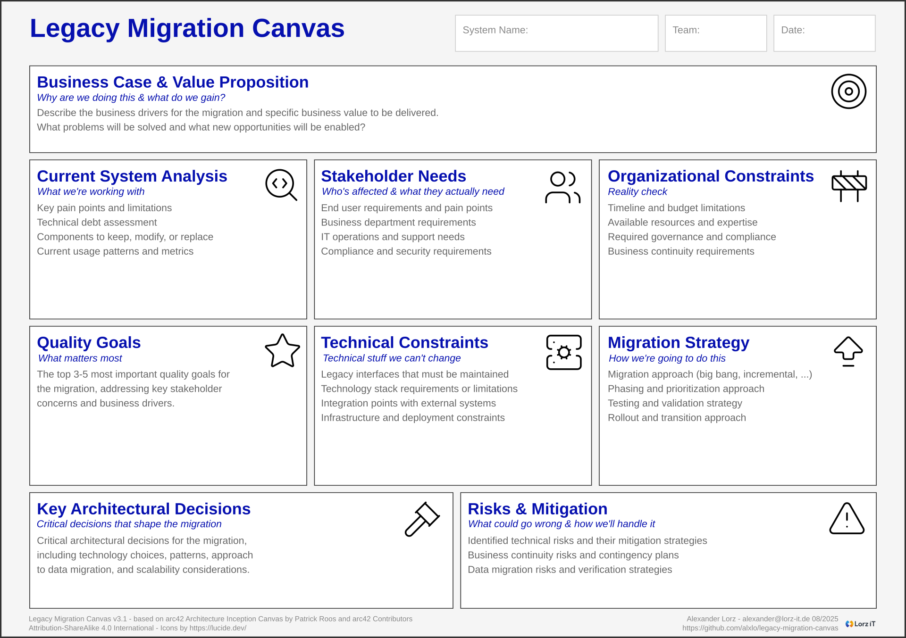

# Legacy Migration Canvas

Planning tools to avoid migration disasters by getting the basics right first.

## Tools

- **Legacy Migration Canvas** - Figure out what you're actually trying to solve before writing code
- **Migration Checklist** - Don't forget the boring stuff that kills projects

## Why This Exists

Migrations fail because teams jump straight into technical solutions without understanding the actual problem.
These tools force you to answer "why are we doing this?" before "how do we build it?"

## Usage

Use canvas and checklist iteratively - start with canvas workshops, then dive into relevant checklist sections.
Keep updating the canvas as you learn more.

## License

[CC BY-SA 4.0](https://creativecommons.org/licenses/by-sa/4.0/)

## Generate

'''
asciidoctor-pdf -a lang-en -a pdf-theme=themes/migration-checklist-theme.yml checklist.adoc -o checklist_EN.pdf
'''
